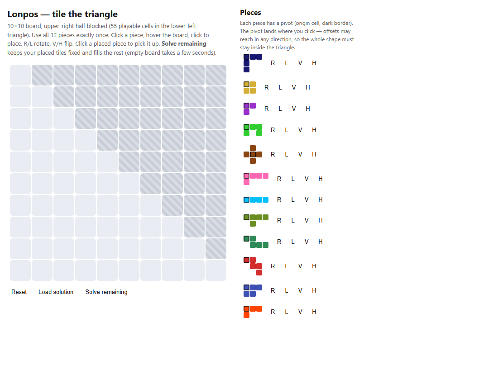
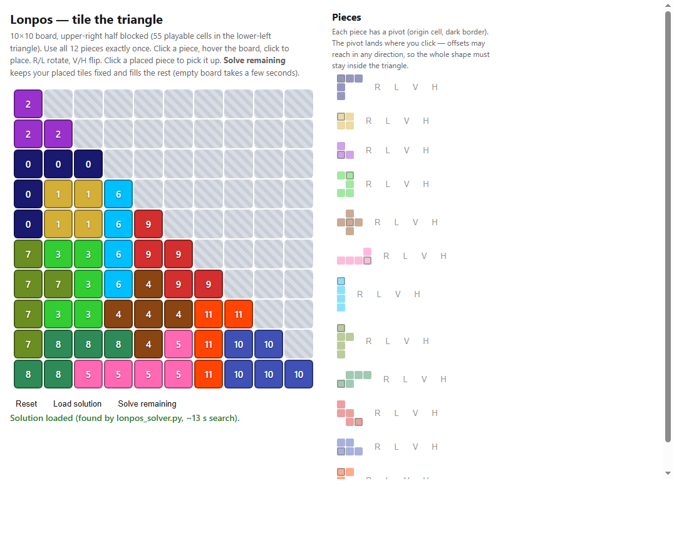

# Lonpos Puzzle

A **triangle-tiling** board puzzle. A 10×10 grid with its upper-right half blocked
leaves a lower-left triangle of exactly **55 playable cells** (1+2+…+10). You must
cover every one of them using all **12 pieces** exactly once.

Each piece has a **pivot** (origin cell). Placing a piece drops its pivot where you
click; its other cells fan out in any direction (they may use negative offsets), so
the whole shape must stay inside the triangle. Every piece can be rotated
clockwise / counter-clockwise and flipped vertically / horizontally.

## Contents

| File | What it is |
|------|-----------|
| `Lonpos.ipynb` | The original notebook that defines the pieces, board, fit-check, and transforms. |
| `lonpos_solver.py` | A standalone **exact-cover backtracking solver** that finds a full tiling in ~13 s. |
| `lonpos_game.html` | A self-contained **playable** version of the puzzle (open in any browser). |

## Screenshots

The playable game — empty board with the 12 pieces ready to place:



A completed tiling (via the "Solve remaining" button / `lonpos_solver.py`):



## Run the notebook
```
python -m jupyter notebook Lonpos.ipynb
```

## Pieces
The 12 pieces are defined as coordinate offsets from their pivot in `pieces_list`
(noted with the classic pentomino/tetromino letters for reference):

| id | shape | cells | id | shape | cells |
|----|-------|-------|----|-------|-------|
| 0  | L-pentomino | 5 | 6  | I-tetromino | 4 |
| 1  | O-tetromino (square) | 4 | 7  | T-pentomino | 5 |
| 2  | V-triomino | 3 | 8  | P-pentomino | 5 |
| 3  | U/N-pentomino | 5 | 9  | W-pentomino | 5 |
| 4  | X-pentomino (cross) | 5 | 10 | U-pentomino | 5 |
| 5  | P-pentomino | 5 | 11 | L-tetromino | 4 |

Total = 55 cells = the number of playable board cells, which is why the triangle
can be tiled with no gaps and no overlaps.

`Board` tracks the grid state and the `does_fit` check; `Piece` holds positions +
pivot and supports the rotate/flip transforms.

## Solve it
```
python lonpos_solver.py
```
Prints a valid tiling (board grid + per-piece placements) and validates that all
55 cells are covered with all 12 pieces used once.

## Play it
Open `lonpos_game.html` in a browser.
- Click a piece, hover the board (green/red preview), click to place.
- Per-piece **R / L / V / H** buttons rotate and flip.
- Click a placed piece to pick it up again.
- **Solve remaining** keeps your placed tiles fixed and backtracks the rest
  (empty board ≈ 5 s). **Load solution** drops in a known full tiling.
